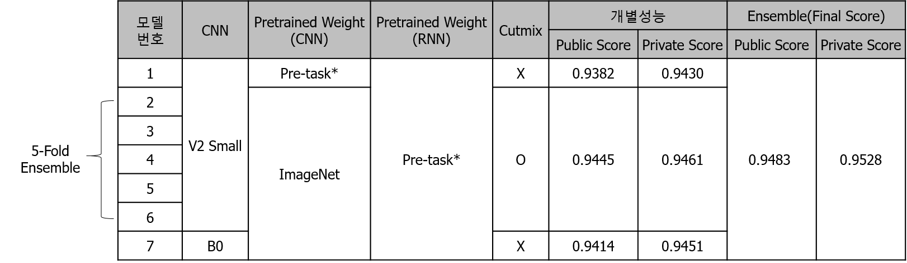

# 농업 환경 변화에 따른 작물 병해 진단 AI 경진대회 ([link](https://dacon.io/competitions/official/235870/overview/description))

## 1. 방법  

저희는 총 7개의 모델을 앙상블하여 최종 결과를 제출하였습니다.  

각 모델의 구조는 다음 그림 모양의 CNN2RNN 큰 틀은 유지하면서,  
다른 CNN 모델을 사용하거나, Data Augmentation 방법을 다르게 하면서 학습하였습니다.  

  

7개 모델의 구성은 다음과 같습니다.  
- CNN모델 EfficientNet B0 또는 V2 Small만을 사용하였습니다.   
- CNN의 Pre-task*는 CNN만을 이용하여 작물병해 분류 작업을 학습한 모델의 Weight를 의미합니다.  
- RNN의 Pre-task*는 RNN만을 이용하여 작물병해 분류 작업을 학습한 모델의 Weight를 의미합니다.  
- Cutmix는 영상과 환경변수 데이터에 모두 적용하였습니다. 

  

## 2. 성능향상을 보였던 방법들  
- 가벼운 CNN 모델을 사용할수록 Score가 높게 나왔습니다  
- CNN은 Pre-task* weight를 하지 않고, RNN은 Pre-task* weight를 사용한 경우가 CNN2RNN의 성능이 더 성능이 좋았습니다. 
- Cutmix는 다음과 같이 영상과 환경변수 데이터에 모두 적용하였습니다.
 환경변수에 대한 Cutmix는 다른 환경변수 뒷 부분의 값을 Lamda에 비례하는 크기만큼 Copy하여 원본 환경변수의 맨 앞에 Paste 하는 방식으로 구현하였습니다. 
 코드를 참고 부탁드립니다.  ([link](https://github.com/hyunseoki/LG_plant_disease/blob/21001591a139a729ba2dce83493a2b2ced72cab1/models0/src/trainer.py#L91))
- 환경변수에 대하여 Cutout도 시도해보았는데, Public Score는 감소하여 최종 제출때는 사용하지 않았습니다. 하지만, 확인해보니 Private는 Score는 오히려 증가하였기 때문에 모델 일반화 성능에 도움이 된 것 같습니다. 
- 여러 모델을 앙상블하면 확실히 모델 일반화 성능은 올라갑니다. 
- 아마도... CNN 모델로 B0을 사용, Cutmix+Cutout+5fold를 하였다면 가장 좋은 성능을 보이지 않았을까 예상합니다. 

  
  

## 3. Ablation Study


## 4. 주요 라이브러리  
python==3.8.5  
numpy==1.21.2  
torch==1.9.0  
timm==0.5.4  
albumentation    
pandas  
scikit-learn  
tqdm  

```
conda env create f conda_requirements.txt ## 또는,
pip install -r pip_requirements.txt
```

## 5. 학습방법  


## 6. 추론방법  


